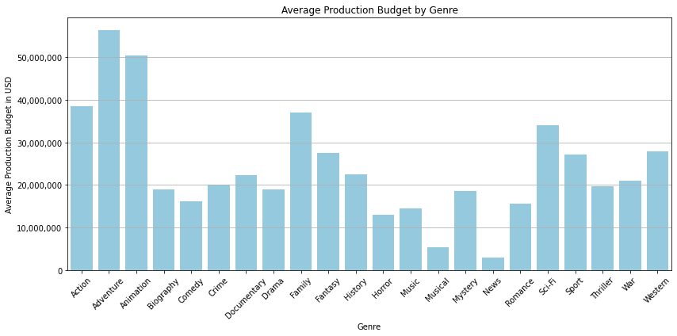

# Phase-2-Project

## Business Understanding
In this hypothetical scenario, our company has decided to expand into content creation, i.e. films.  We will analyze over 100 years of film data to determine indicators of success and offer this consultation to our company.

We define success as: 
* total gross
* total profit
* ROI
 
Cue's to movie success we will consider are:
* runtime
* budget
* year produced
* genre

This Project utilizes the following datasets:

* [Box Office Mojo](https://www.boxofficemojo.com/)
* [IMDB](https://www.imdb.com/)
* [Rotten Tomaotes](https://www.rottentomatoes.com/)
* [TheMovieDB](https://www.themoviedb.org/)
* [The Numbers](https://www.the-numbers.com/)

We have over 100 years of film data from multiple datasets.  To get started, we will explore the datasets indivdually and consolidate the important columns.

## Initial EDA
Loading the datasets as individual df's to clean and prepare columns for analysis.  Once we determine which columns we will use, they can then be joined together for analysis.  It's important that we do this now, so we don't run into issues performin regression analysis and creatong visuals.

## Data Analysis
We will analyze this data in a variety of ways to best understand it.  Charts, graphs, and regression analysis will help us interpret the data and project future trends.
A correlation heatmap can show us the strength of correlations between different variables in our dataframe.  We can see links between budget, profit, gross, ROI.

In comparing ROI and Budget, we can see that movies that had a larger budget typically had solid returns as well. 

Now we can infer that higher budgets lead to more profit, which substantiates what we saw in the previous images. 

lastly, we have a strong regression analysis showing us that increased budget leads to increased profits.

Now, let's analzye what accompanies higher budgets.  We can see that animation and adventure movies have large budgets-compared to Mystery and documentary movies.

Now, let's look at some information on the leading directors.  Maybe we can figure out of a specific director is a cash cow or not.

We see significant overlap here in the directors with the average biggest budget per movie and the directors with the highest profit per movie. For context, here are the 6 directors that appear in both categories:

* Michael Bay
* Brad Bird
* David Yates
* Rahim Behboodi
* Neil Boultby
* Adam Green

## Conclusions
* There is a strong correlation between budget and profit and therefore ROI.
* Animation, Adventure, and Mystery Movies all seem to be the most popular movie genres currently.
* One of the following directors is sure to bring commercial success:

* Michael Bay
* Brad Bird
* David Yates
* Rahim Behboodi
* Neil Boultby
* Adam Green

## Limitations
* Data mostly seems to be American movies.
* Data was fairly incomplete and some tables were not able to be used as frame of reference was missing.

## Next Steps.
* In depth review on ratings to see which movies are actually the "best"
* Compare international movies for worldwide success.

